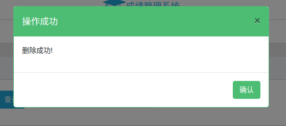

#                         学生成绩管理系统

### **一.项目设计：**

（1）项目总体构成：用户登陆，用户注册，学生成绩插入，学生成绩总览，删除数据功能 ，精确查询功能 ，模糊查询功能 ，数据分页

（2）引入包的相关说明： 

*body-parser*：是一个HTTP请求体解析的中间件,使用这个模块可以解析JSON、Raw、文本、URL-encoded格式的请求体，用于加载body-parser处理post提交的数据

*mongoose*：一个操作 mongodb 的nodejs 驱动库，用于加载数据库模块

*Express* ：是一个基于 Node.js 平台的极简、灵活的 web 应用开发框架,它提供一系列强大的特性。

*child_process*：可自动打开浏览器模块

*ejs*：渲染静态页面

*cors*：解决拦截跨源请求问题

 *formidable*：用来获取解析 form-data 对象，或用于文件上传以及表单数据解析

（3）项目目录结构和各个部分的说明：

1.models： scores.js：学生成绩构成  user.js：用户信息构成

2.public： css，jquery/js，js：用于主体样式 页面布局等页面美化  favicon.ico：用于设置网页小图标

3.router： router.js：用于设置路由模块，实现项目主要功能

4.views： index.html：主要操作页面  login.html：登陆页面  register.html：注册页面

5.app.js：设置服务器模块

6.package-lock.json：锁定安装时的版本号并上传到git上,保证其他人在npm install时下载的依赖都保持一致

7.package.json：定义了项目所需要的各种模块,以及项目的配置信息

### 二.使用说明书

1）登陆功能：输入用户名及密码登陆系统，点击注册页面进入注册用户

2）注册功能：输入用户信息完成注册，点击去登陆跳转到登陆页面

3）操作页面：

4）学生成绩操作：点击右上角导入加号导入成绩

点击保存录入数据

删除：点击删除删除对应数据，确认执行操作

点击编辑可对学生成绩更改：

5）查询操作：

输入学号进行精准查询：

输入姓名关键字进行模糊查询

不存在时会有弹窗警示：

### 三：开发日记

1.创建项目并且创建数据模型score.js

2.基本页面文件创建

3.开始编写路由，导入美化框架

4.开始写服务器代码

5.页面代码编写

6.页面代码编写

7.整体修改及页面编写

8.主要功能完善

9.新增用户数据模型

10.开始编写用户登陆注册功能

11.功能基本实现